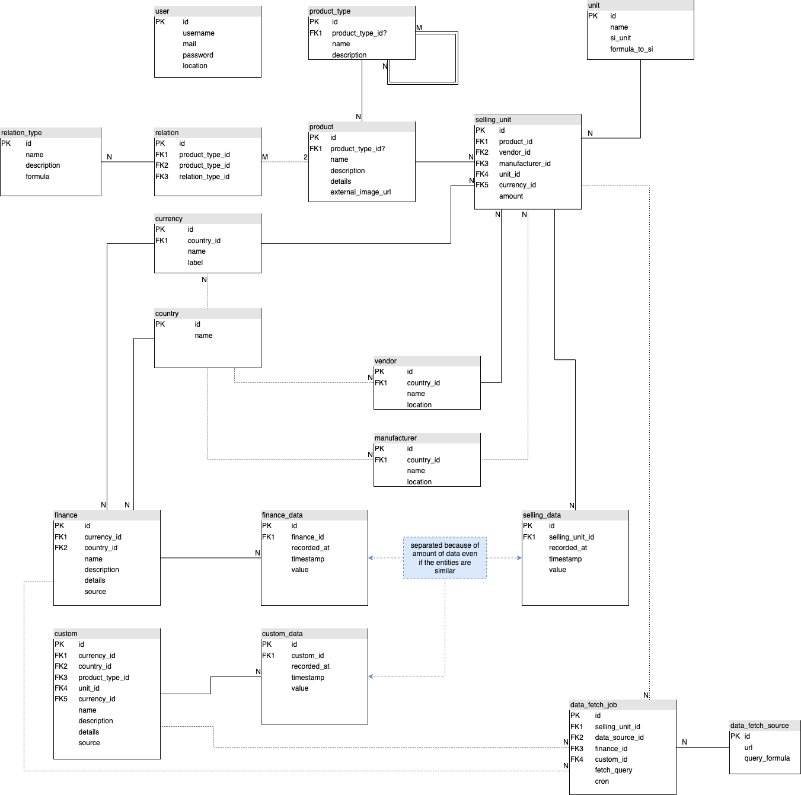

# ProductMiner

ProductMiner is an extendable price monitoring software. Give it a place to live, feed it with API definitions, and it
will record the prices of your favorite products.

## Background

This project began as my first Ruby project. Compared to other hello-world projects, I intend to make this a
full-featured product.
As this is my first Ruby project, I planned the roadmap for my learning rather than for efficiency. That's why there
will be a lot of refactorings to do.

## Usage (dev only for now)

### Requirements

- Redis
  - Via Docker: `docker run --name pm-redis -p "6379:6379" -d redis redis-server --save 60 1 --loglevel warning`
- Postgres
  - Username: `product_miner`
  - Database: `product_miner_development` (created by rails)

### Run

Before you start the dev server, you have to set the env var `PG_PASSWORD` to your postgres password for the rails user *(product_miner)*.
To start the dev server then, use `bin/dev`. This starts the web server and the css file watcher for rebuilding the stylesheets with tailwind.

```bash
export PG_PASSWORD=<your-password>
bin/dev
```

## Documentation

### Database schema



### Miner jobs

...

## Roadmap

- [x] First Miner (reduced features)
  - [x] Initial project setup
  - [x] Implement Migros API (Basics)
  - [x] Scheduler for monitoring tasks (Basics)
- [ ] Database
  - [x] Hierarchy association: Ancestry gem
  - [ ] Research and decision: pg_timeseries plugin
- [ ] Ruby, project configuration, pipelines
  - [ ] Rake configurations
  - [ ] Github pipelines
  - [ ] Tests
- [x] DB relation schema, first throw
- [x] Website, initial setup
  - [x] Initial RoR setup
- [ ] Website and Miner improvements
  - [ ] CRUD of first models
  - [ ] Basic configurations
    - [ ] Multiple products by ID
    - [ ] Save configurations in the Postgres database
  - [ ] Simple data viewer
    - [ ] Selection with settings
    - [ ] Linechart of prices over time
  - [ ] Miner settings
  - [ ] Record prices in a Postgres database
- [ ] Website
  - [ ] User Registration ()
  - [ ] Security
  - [ ] t.b.d.
- [ ] Other miners

## Miners

### Migros

API-Docs: [search-api.migros.ch](https://search-api.migros.ch/doc#)
